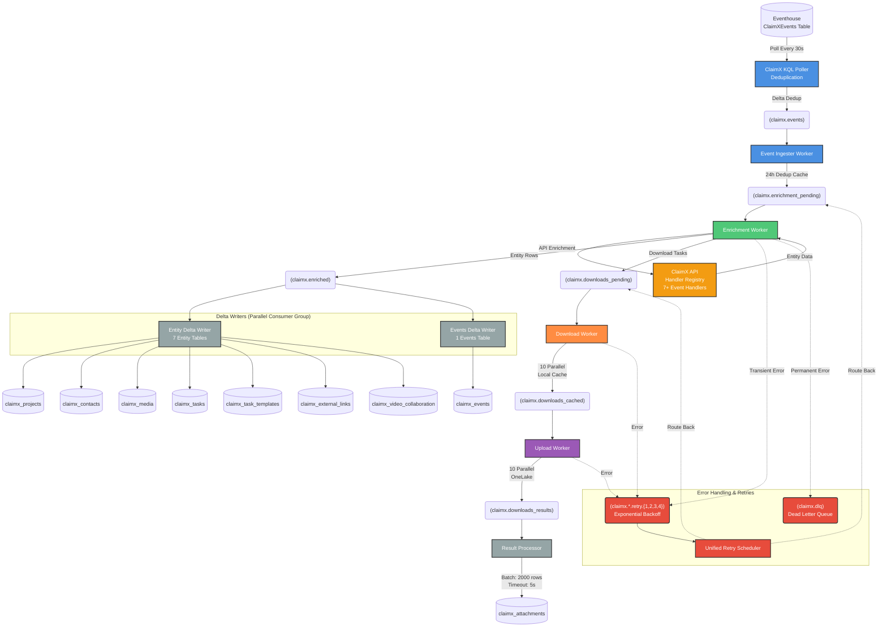

# ClaimX Pipeline Architecture

This document describes the ClaimX event processing pipeline, showing the complete flow from event ingestion through enrichment, download, upload, and storage in Delta Lake.

## Overview

The ClaimX pipeline processes events from an Eventhouse (Kusto) database containing ClaimX project management events. The KQL poller continuously polls the ClaimXEvents table, then events are enriched with API data and associated media files are downloaded. Unlike the Verisk pipeline, ClaimX requires API enrichment to fetch entity data before any downloads can occur.

## Pipeline Flow Diagram



## Component Details

### ClaimX KQL Poller
- **Source**: Eventhouse ClaimXEvents table
- **Polling**: Continuous polling at 30-second intervals (configurable)
- **Deduplication**: Query-side dedup against claimx_events Delta table (24-hour window)
- **Produces to**: `claimx.events` topic
- **Checkpoint**: Tracks last processed event for resume
- **Backfill Support**: Can run historical backfill with start/stop timestamps
- **File**: `src/pipeline/common/eventhouse/poller.py`

### Event Ingester Worker
- **Consumes from**: `claimx.events` (fed by KQL Poller)
- **Produces to**: `claimx.enrichment_pending`
- **Function**: Ingests polled events and creates enrichment tasks
- **Deduplication**: 24-hour in-memory cache based on event_id (secondary dedup)
- **Key Logic**: All events trigger enrichment (not just file events)
- **File**: `src/pipeline/claimx/workers/event_ingester.py`

### Enrichment Worker
- **Consumes from**: `claimx.enrichment_pending`
- **Produces to**:
  - `claimx.enriched` (entity rows for Delta)
  - `claimx.downloads_pending` (download tasks)
- **Function**: Enriches events with ClaimX API data
- **Handler Registry**: Routes events by type to 7+ specialized handlers
- **Concurrency**: Single-task processing (Delta writer handles batching)
- **API Client**: Circuit breaker pattern with configurable timeout
- **File**: `src/pipeline/claimx/workers/enrichment_worker.py`

### Handler System
- **Base Handler**: `src/pipeline/claimx/handlers/base.py`
- **Registry**: Dynamic handler registration by event type
- **Handlers Include**:
  - Project handlers (create, update)
  - Contact handlers
  - Media handlers
  - Task handlers
  - Video collaboration handlers
  - External link handlers
- **Output**: EntityRowsMessage containing rows for all 7 entity types

### Delta Writers (Parallel Processing)
- **Consumer Group**: Separate from enrichment worker
- **Entity Writer**:
  - **File**: `src/pipeline/claimx/writers/delta_entities.py`
  - **Tables**: 7 entity tables (projects, contacts, media, tasks, task_templates, external_links, video_collaboration)
  - **Function**: Writes entity data with upsert logic
- **Events Writer**:
  - **File**: `src/pipeline/claimx/writers/delta_events.py`
  - **Table**: claimx_events
  - **Function**: Writes raw event records

### Download Worker
- **Consumes from**: `claimx.downloads_pending`
- **Produces to**: `claimx.downloads_cached`
- **Function**: Downloads media files from ClaimX URLs
- **Concurrency**: 10 parallel downloads
- **Caching**: Local filesystem cache before upload
- **File**: `src/pipeline/claimx/workers/download_worker.py`

### Upload Worker
- **Consumes from**: `claimx.downloads_cached`
- **Produces to**: `claimx.downloads_results`
- **Function**: Uploads files to OneLake storage
- **Concurrency**: 10 parallel uploads
- **File**: `src/pipeline/claimx/workers/upload_worker.py`

### Result Processor
- **Consumes from**: `claimx.downloads_results`
- **Writes to**: Delta table `claimx_attachments`
- **Function**: Batches download results for Delta Lake
- **Batching**: 2000 records or 5-second timeout
- **Consumer Group**: Separate from other workers

## Error Handling

### Retry Strategy
- **Retry Topics**: `claimx.*.retry.{1,2,3,4}`
- **Backoff**: Exponential with delays configured per domain
- **Max Retries**: 4 attempts (configurable)
- **Classification**:
  - `TRANSIENT` → Retry with backoff
  - `PERMANENT` → Send to DLQ immediately
  - `CIRCUIT_OPEN` → Reprocess when circuit closes
  - `AUTH` → Retry (may recover if token refreshes)

### Dead Letter Queue
- **Topic**: `claimx.dlq`
- **Purpose**: Permanent failures after max retries
- **Handling**: Manual review and reprocessing via DLQ CLI
- **File**: `src/pipeline/claimx/dlq/handler.py`

### Unified Retry Scheduler
- **Function**: Routes retry messages back to pending topics
- **Logic**: Inspects retry count and routes accordingly
- **Files**: `src/pipeline/claimx/retry/`

## Data Flow Summary

1. **Polling**: ClaimX KQL Poller queries Eventhouse every 30s → Deduplicates against Delta table → Produces to claimx.events
2. **Ingestion**: Event Ingester consumes from claimx.events → Additional deduplication → Produces to enrichment_pending
3. **Enrichment**: Enrichment Worker calls ClaimX API via handler registry → Produces entity rows and download tasks
4. **Parallel Delta Writes**: Entity and Events writers (separate consumer groups) consume from enriched topic → Write to 8 Delta tables
5. **Download**: Download Worker fetches media files → Caches locally
6. **Upload**: Upload Worker sends files to OneLake → Produces results
7. **Result Storage**: Result Processor batches results → Writes to attachments table
8. **Error Recovery**: Failed tasks route through retry topics → Back to pending or DLQ

## Key Differences from Verisk Pipeline

- **Event Source**: Both pipelines poll from Eventhouse (ClaimXEvents vs Events tables)
- **API Enrichment Required**: ClaimX requires API calls to get entity data before downloads
- **Multiple Entity Tables**: 7 entity tables vs Verisk's 2 tables (events + attachments)
- **Handler Registry**: Event type routing system for specialized enrichment logic
- **No Plugin System**: Direct handler execution instead of extensible plugins
- **Single Domain**: No multi-domain routing in upload worker

## Configuration

### Eventhouse Source
```bash
# Required
EVENTHOUSE_CLUSTER_URL="https://your-cluster.kusto.windows.net"
CLAIMX_EVENTHOUSE_DATABASE="YourDatabase"

# Optional
CLAIMX_POLL_INTERVAL_SECONDS=30
CLAIMX_POLL_BATCH_SIZE=1000
CLAIMX_EVENTS_TABLE_PATH="path/to/claimx_events"  # For deduplication
```

### Key Environment Variables
- `PIPELINE_DOMAIN=claimx`
- `EVENTHOUSE_CLUSTER_URL`: Kusto cluster URL
- `CLAIMX_EVENTHOUSE_DATABASE`: Database name
- `CLAIMX_EVENTS_TABLE_PATH`: Path to claimx_events Delta table (for dedup)
- `CLAIMX_API_URL`: ClaimX API endpoint
- `CLAIMX_API_TOKEN`: API authentication token
- `CLAIMX_API_CONCURRENCY`: Max concurrent API calls
- Delta table paths: `CLAIMX_{ENTITY}_TABLE_PATH`

See `src/config/pipeline_config.py` for complete configuration options.

## Operational Characteristics

### Scaling
- **KQL Poller**: Single instance recommended (checkpointing is per-poller)
- **Event Ingester**: Single instance recommended (dedup cache is in-memory)
- **Enrichment Worker**: Horizontal scaling supported (separate instances)
- **Delta Writers**: Independent scaling (different consumer groups)
- **Download/Upload Workers**: Horizontal scaling with partition distribution

### Performance
- **Eventhouse Polling**: 30-second intervals, 1000 events/batch (configurable)
- **Deduplication**: Two-layer (KQL query-side + in-memory cache)
- **API Calls**: Circuit breaker prevents cascading failures
- **Concurrency**: 10 parallel downloads/uploads per worker instance
- **Batching**: Delta writers handle batching internally (larger batches: 2000 rows vs Verisk's 100)
- **Caching**: Local file cache reduces re-download overhead

### Monitoring
- Health check servers on all workers (configurable ports)
- Prometheus metrics for processing rates and errors
- Cycle logging every 30 seconds with success/failure counts
- Structured logging with trace context propagation
