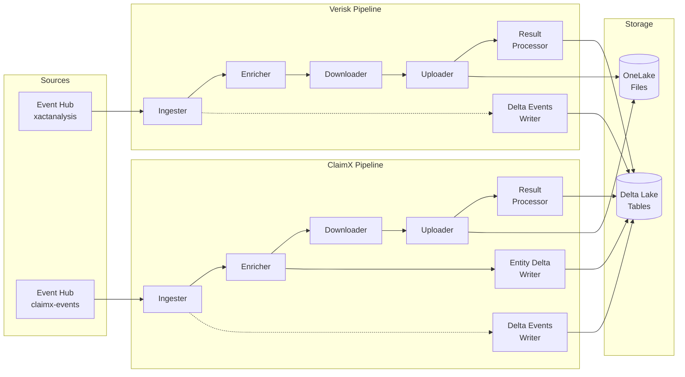
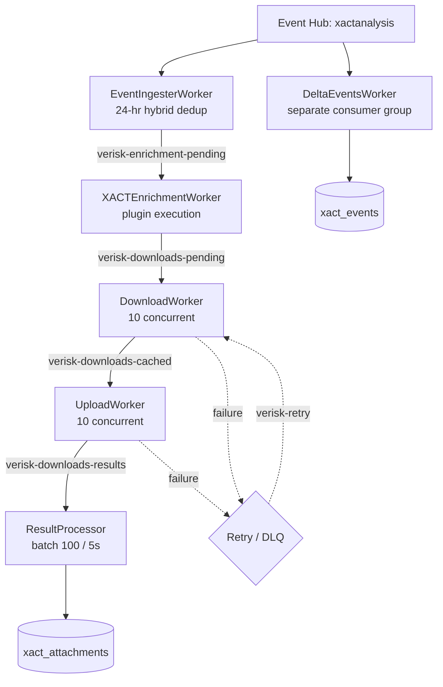
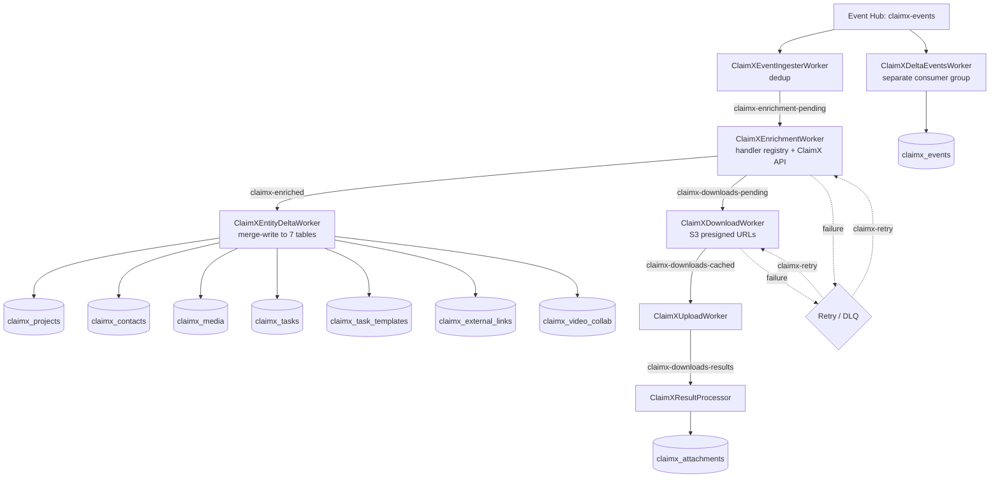
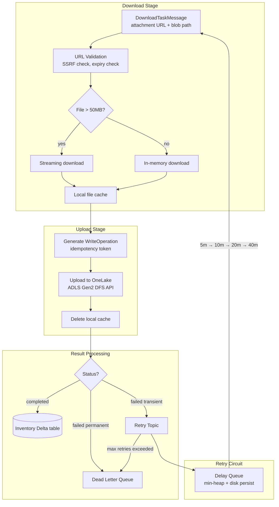
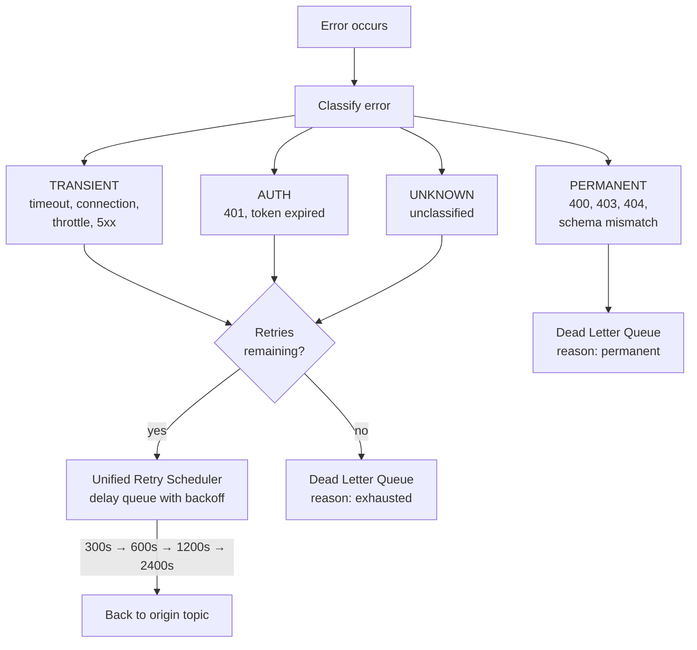
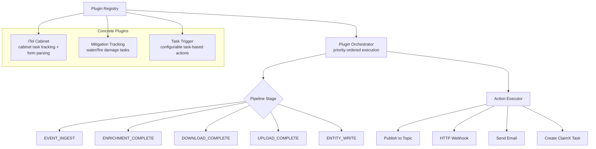

# Pipeline Overview (TL;DR)

Event-driven pipeline that ingests insurance claims events from Azure Event Hub, enriches them with external API data, downloads and uploads file attachments to OneLake (ADLS Gen2), and persists structured data to Delta Lake tables. Two parallel domains: **Verisk (XACT)** for XactAnalysis estimate events, and **ClaimX** for ClaimX project/task/media events. Everything runs as async Python workers connected by Kafka topics.

## Tech Stack

| Layer | Technology |
|-------|-----------|
| Language | Python 3.12, asyncio |
| Messaging | aiokafka, Azure Event Hub (AMQP/WebSocket) |
| Storage | OneLake (ADLS Gen2), Delta Lake |
| Data | Polars, deltalake-python |
| HTTP | aiohttp (downloads), FastAPI (health) |
| Config/Validation | Pydantic, YAML |
| Observability | Prometheus, structured JSON logging, EventHub log sink |
| Deployment | Docker |

## Architecture

### High-Level View



### Verisk (XACT) Pipeline



### ClaimX Pipeline



### File Download & Upload Flow (Detail)



### Error Handling & Retry



### Plugin System



## Project Structure

```
src/
├── pipeline/
│   ├── __main__.py              # CLI entry point
│   ├── verisk/                  # XACT domain
│   │   ├── workers/             # 6 workers + retry handler
│   │   ├── schemas/             # Pydantic message models
│   │   └── writers/             # Delta Lake writers
│   ├── claimx/                  # ClaimX domain
│   │   ├── workers/             # 7 workers + retry handlers
│   │   ├── handlers/            # 5 event handlers + registry
│   │   ├── schemas/             # Pydantic message models
│   │   ├── writers/             # Delta Lake writers (entities + events)
│   │   └── api_client.py        # ClaimX API (circuit breaker + rate limit)
│   ├── common/                  # Shared infrastructure
│   │   ├── transport/           # Kafka/EventHub abstraction
│   │   ├── storage/             # OneLake client
│   │   ├── retry/               # Delay queue + unified scheduler
│   │   ├── dlq/                 # Dead letter queue producer
│   │   └── metrics.py           # Prometheus metrics
│   ├── plugins/                 # Plugin framework
│   │   ├── shared/              # Registry, base classes, loader
│   │   ├── itel_cabinet_api/    # iTel Cabinet plugin
│   │   └── claimx_mitigation_task/  # Mitigation plugin
│   └── runners/                 # Worker registry & launch
├── core/                        # Core utilities
│   ├── download/                # HTTP downloader + streaming
│   ├── auth/                    # Azure authentication
│   ├── security/                # URL/file validation (SSRF prevention)
│   ├── errors/                  # Error classification + exceptions
│   └── resilience/              # Circuit breaker
├── config/                      # Config loading (YAML + env)
└── scripts/
tests/                           # Mirrors src/ structure
```

## Worker Reference

| CLI Name | Domain | Purpose |
|----------|--------|---------|
| `xact-event-ingester` | Verisk | Consume EventHub events, 24-hr dedup, produce enrichment tasks |
| `xact-enricher` | Verisk | Execute plugins, create download tasks from attachments |
| `xact-download` | Verisk | Download attachments (10 concurrent), cache locally |
| `xact-upload` | Verisk | Upload cached files to OneLake, idempotent |
| `xact-result-processor` | Verisk | Batch results, write to xact_attachments Delta table |
| `xact-delta-writer` | Verisk | Write raw events to xact_events Delta table |
| `xact-retry-scheduler` | Verisk | Unified retry routing with exponential backoff |
| `claimx-ingester` | ClaimX | Consume EventHub events, dedup, produce enrichment tasks |
| `claimx-enricher` | ClaimX | Route to handlers, call ClaimX API, produce entities + downloads |
| `claimx-downloader` | ClaimX | Download media from S3 presigned URLs |
| `claimx-uploader` | ClaimX | Upload cached files to OneLake |
| `claimx-result-processor` | ClaimX | Write results to claimx_attachments Delta table |
| `claimx-entity-writer` | ClaimX | Merge-write to 7 entity Delta tables |
| `claimx-delta-writer` | ClaimX | Write raw events to claimx_events Delta table |
| `claimx-retry-scheduler` | ClaimX | Unified retry routing with exponential backoff |
| `itel-cabinet-tracking` | Plugin | Track iTel cabinet task assignments and submissions |
| `itel-cabinet-api` | Plugin | iTel cabinet API integration worker |
| `claimx-mitigation-tracking` | Plugin | Track water/fire mitigation task completions |

## How to Run

```bash
# Run a specific worker
python -m pipeline --worker xact-download

# Run with options
python -m pipeline --worker claimx-enricher --log-level DEBUG --dev --no-delta

# Multiple instances (partition distribution)
python -m pipeline --worker xact-download --count 4
```

| Flag | Effect |
|------|--------|
| `--worker NAME` | Run a specific worker (default: all) |
| `--dev` | Development mode (EventHub only, no Eventhouse) |
| `--no-delta` | Skip Delta Lake writes |
| `--count N` | Number of worker instances |
| `--log-level` | DEBUG, INFO, WARNING, ERROR |
| `--log-to-stdout` | Console logging (for containers) |
| `--metrics-port` | Prometheus metrics port (default: 8000) |
