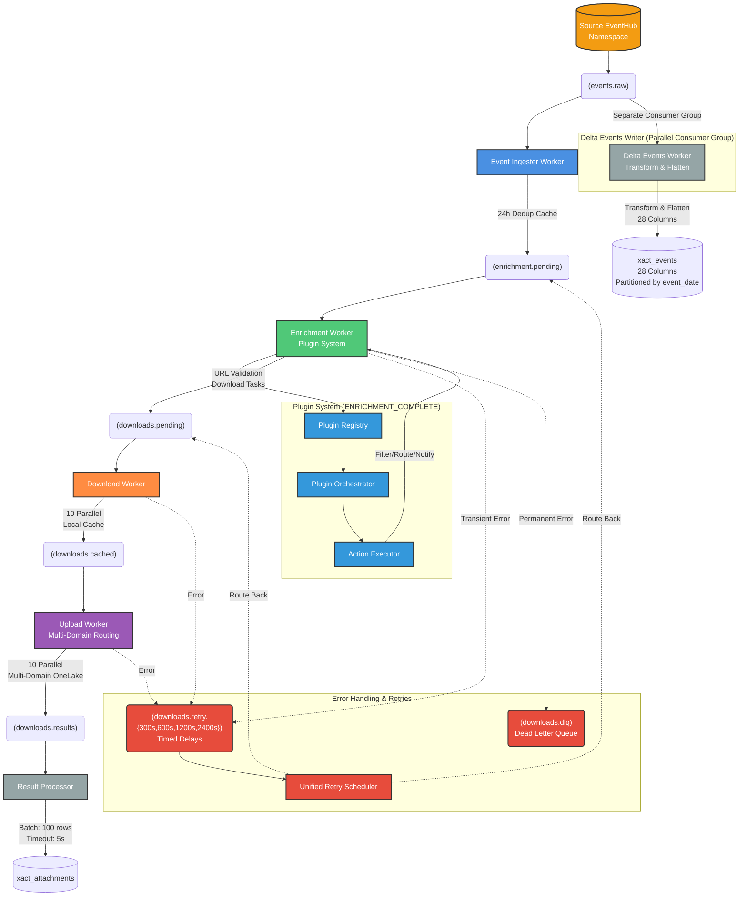

# Verisk Pipeline Architecture

This document describes the Verisk (XACT) event processing pipeline, showing the complete flow from event ingestion through plugin execution, download, upload, and storage in Delta Lake.

## Overview

The Verisk pipeline processes XACT estimation events from a source EventHub namespace. The event ingester consumes raw events, applies deduplication, and feeds them into the pipeline. The pipeline executes custom plugins for filtering and routing, then downloads and stores associated attachments. Unlike ClaimX, Verisk uses an extensible plugin system at the enrichment stage and has simpler storage (2 Delta tables vs ClaimX's 8).

## Pipeline Flow Diagram



## Component Details

### Event Ingester Worker
- **Consumes from**: `events` topic (source EventHub namespace)
- **Produces to**: `enrichment.pending`
- **Function**: Ingests raw events and creates enrichment tasks
- **Deduplication**: 24-hour hybrid cache (in-memory + blob storage) based on trace_id
- **Key Generation**: Deterministic UUID5 event_id from trace_id
- **File**: `src/pipeline/verisk/workers/event_ingester.py`

### Enrichment Worker
- **Consumes from**: `enrichment.pending`
- **Produces to**: `downloads.pending`
- **Function**: Executes plugins and creates download tasks
- **Plugin Stage**: `ENRICHMENT_COMPLETE`
- **URL Validation**: Sanitizes and validates attachment URLs
- **No API Calls**: Unlike ClaimX, no external enrichment needed
- **File**: `src/pipeline/verisk/workers/enrichment_worker.py`

### Plugin System
- **Registry**: `src/pipeline/plugins/shared/registry.py`
- **Base Plugin**: `src/pipeline/plugins/shared/base.py`
- **Loader**: Dynamic loading from `config/plugins/`
- **Execution**: Plugin orchestrator runs all registered plugins
- **Actions**: Plugins can filter events, send notifications, or terminate pipeline
- **Examples**:
  - Status trigger plugins (filter by status_subtype)
  - Notification plugins (send alerts)
  - Custom routing logic

### Delta Events Writer (Parallel)
- **Consumes from**: `events.raw` (same topic as ingester)
- **Consumer Group**: Separate from event ingester
- **Transform**: `flatten_events()` function converts nested JSON to 28 columns
- **Partitioning**: By event_date for query performance
- **File**: `src/pipeline/verisk/workers/delta_events_worker.py`
- **Transform Logic**: `src/pipeline/verisk/writers/transform.py`
- **Output**: Single table `xact_events`

### Download Worker
- **Consumes from**: `downloads.pending`
- **Produces to**: `downloads.cached`
- **Function**: Downloads attachment files from validated URLs
- **Concurrency**: 10 parallel downloads
- **Caching**: Local filesystem cache before upload
- **File**: `src/pipeline/verisk/workers/download_worker.py`

### Upload Worker
- **Consumes from**: `downloads.cached`
- **Produces to**: `downloads.results`
- **Function**: Uploads files to OneLake storage
- **Multi-Domain Routing**: Routes to different OneLake paths by event_type
- **Concurrency**: 10 parallel uploads
- **File**: `src/pipeline/verisk/workers/upload_worker.py`

### Result Processor
- **Consumes from**: `downloads.results`
- **Writes to**: Delta table `xact_attachments`
- **Function**: Batches download results for Delta Lake
- **Batching**: 100 records or 5-second timeout (smaller than ClaimX)
- **Consumer Group**: Separate from other workers

## Error Handling

### Retry Strategy
- **Retry Topics**: `downloads.retry.{300s,600s,1200s,2400s}`
- **Delays**: Fixed time-based delays (5min, 10min, 20min, 40min)
- **Max Retries**: 4 attempts (configurable)
- **Classification**:
  - `TRANSIENT` → Retry with timed delay
  - `PERMANENT` → Send to DLQ immediately
  - `CIRCUIT_OPEN` → Reprocess when service recovers
  - `UNKNOWN` → Retry (default safe behavior)

### Dead Letter Queue
- **Topic**: `downloads.dlq`
- **Purpose**: Permanent failures after max retries
- **Handling**: Manual review and reprocessing
- **File**: `src/pipeline/verisk/retry/`

### Unified Retry Scheduler
- **Function**: Routes retry messages back to pending topics
- **Logic**: Time-based scheduling for retry delivery
- **Implementation**: Similar to ClaimX but with different delays

## Data Flow Summary

1. **Ingestion**: Event Ingester consumes from source EventHub events topic → Deduplication → Produces to enrichment_pending
3. **Parallel Delta Write**: Delta Events Worker (separate consumer group) transforms events.raw and writes to xact_events table
4. **Enrichment**: Enrichment Worker executes plugins → Validates URLs → Produces download tasks
5. **Download**: Download Worker fetches attachments → Caches locally
6. **Upload**: Upload Worker sends to OneLake with multi-domain routing → Produces results
7. **Result Storage**: Result Processor batches results → Writes to attachments table
8. **Error Recovery**: Failed tasks route through timed retry topics → Back to pending or DLQ

## Key Differences from ClaimX Pipeline

### Event Source
- **Source EventHub**: Consumes raw events directly from source EventHub namespace
- **Same Pattern as ClaimX**: Both pipelines consume from source EventHub topics

### Simpler Storage Model
- **2 Delta Tables**: events + attachments (vs ClaimX's 8 tables)
- **Transform Stage**: flatten_events() converts nested JSON to flat schema
- **No Entity Tables**: Events are self-contained, no separate entity normalization

### Plugin System
- **Extensible**: Dynamic plugin loading from config directory
- **Event-Driven**: Plugins execute at ENRICHMENT_COMPLETE stage
- **Actions**: Filter, route, notify via action executor
- **ClaimX**: Fixed handler registry, no plugin extensibility

### Multi-Domain Upload
- **Routing**: Upload worker routes by event_type to different OneLake domains
- **Flexibility**: Supports multiple destination paths from single worker
- **ClaimX**: Single domain routing only

### No API Enrichment
- **Self-Contained**: Events contain all needed data
- **URL Generation**: Attachment URLs in event payload
- **ClaimX**: Requires API calls to fetch entity data and download URLs

## Configuration

### Event Source
```bash
# Source EventHub namespace (where raw events originate)
SOURCE_EVENTHUB_NAMESPACE_CONNECTION_STRING="Endpoint=sb://..."
```

### Key Environment Variables
- `PIPELINE_DOMAIN=verisk`
- `SOURCE_EVENTHUB_NAMESPACE_CONNECTION_STRING`: Source EventHub namespace connection string
- `EVENTHUB_NAMESPACE_CONNECTION_STRING`: Internal EventHub namespace connection string
- `VERISK_EVENTS_TABLE_PATH`: Path to xact_events Delta table (for dedup)
- `VERISK_INVENTORY_TABLE_PATH`: Path to xact_attachments Delta table
- Plugin directory: `config/plugins/verisk/`

See `src/config/pipeline_config.py` for complete configuration options.

## Operational Characteristics

### Scaling
- **Event Ingester**: Horizontal scaling supported (shares events topic consumption)
- **Delta Events Writer**: Horizontal scaling with partition distribution
- **Enrichment Worker**: Horizontal scaling supported
- **Download/Upload Workers**: Horizontal scaling with partition distribution

### Performance
- **Deduplication**: In-memory cache with blob storage persistence
- **Parallel Delta Writes**: Separate consumer group allows independent scaling
- **Plugin Execution**: Minimal overhead, plugins run synchronously
- **Batching**: Smaller batches (100 vs ClaimX's 2000) for faster Delta writes

### Monitoring
- Health check servers on all workers (configurable ports)
- Prometheus metrics for processing rates and errors
- Cycle logging every 30 seconds with success/failure counts
- Structured logging with trace_id propagation
- Plugin execution metrics (success/failure counts)

## Plugin Development

To add a custom plugin:

1. Create plugin in `config/plugins/verisk/my_plugin/`
2. Implement `PluginBase` interface
3. Register hooks for `ENRICHMENT_COMPLETE` stage
4. Use `PluginContext` for event data access
5. Return `PluginAction` to filter/route/notify

Example plugins:
- `src/config/plugins/verisk/status_trigger/`: Filter by status_subtype
- Plugin base: `src/pipeline/plugins/shared/base.py`
- Plugin loader: `src/pipeline/plugins/shared/loader.py`
